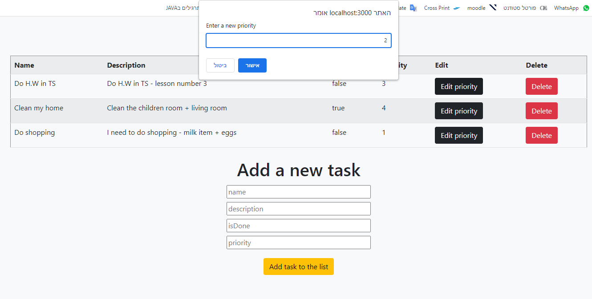
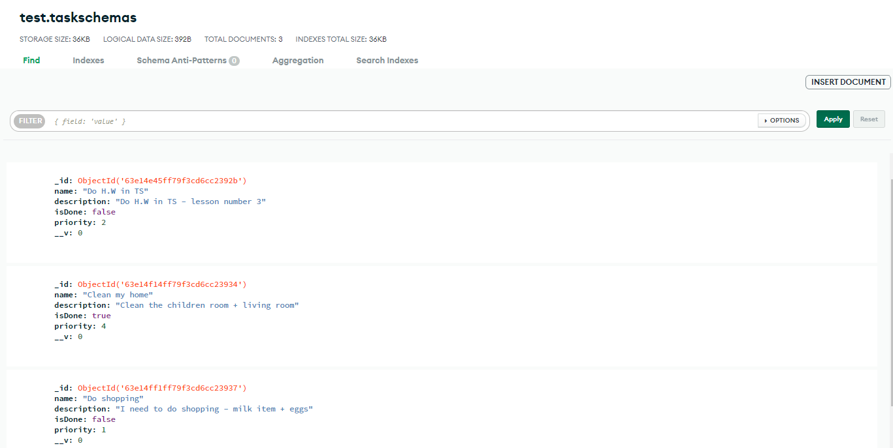

# Task list

My app is about Task List. we can shoe all the task, add a new task(name, description, isDone and priority), update priority of task and delete a task.
All operations are synchronized with a database!

For start the server you need to write "npm start" in the terminal, and after open "http://localhost:3000/" in browser.

Good fun!

@Idan yaron 2023

Home page:

Update priority:

Home page upter update the first task:

Mongo DB page:

